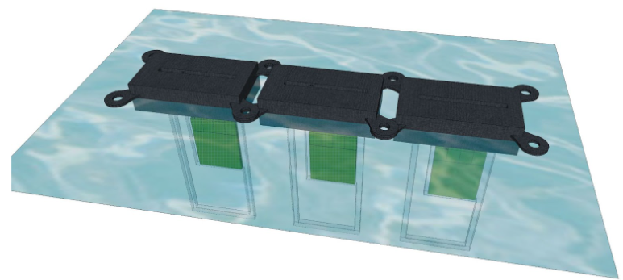
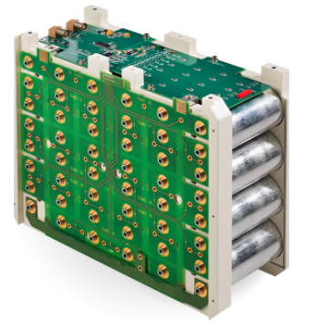

# Balancing climate change and digital growth

## Datacenter energy growth

## Energy = C02 emissions

Example:  In Australia, 766g CO2 per kWh
For 1 server 80W =  527Kg C02 / year

## Datacenter Power Usage Effectiveness (PUE)

The average power usage effectiveness (PUE) ratio for a data center in 2020 is 1.58, only marginally better than 7 years ago, according to the latest annual Uptime Institute survey (findings to be published shortly).

## Solar Floating PV Plants

* 15 years experience
* 240 installed projects
* 600+ MWp
* 30 countries (including USA)
* Patented technology from [Ciel-et-Terre](https://www.ciel-et-terre.net/)

## Innovation : Solar Floating PV Datacenters

Add underwater servers powered directly by PV panels:
* Underwater aluminium waterproof boxes including a motherboard and SSD disks
* Efficient cooling in a dielectric fluid using the passive thermosyphon effect.
* A Switched BMS battery to store and convert PV panel energy

## Underwater view : immersed battery + server

## Helicopter view : autonomous repeatable cells

## Satellite view : small distributed kubernetes clusters

## Switched BMS Battery

The switched Battery Management System dynamically configure 1.2v cells in serie and parallel to accept and deliver any kind of voltages. (Patented technology from [otonohm](https://www.otonohm.com/our-technology))

## Benefits : Datacenter PUE ~= 0

* No more high-low voltage conversion and transport loss, short and thick electrical cables.
* No more energy for cooling, the dielectric fluid and the water spread the heat (and the PV panels block solar heat input), the thermosyphon effect helps to spread the heat for free.
* Cheaper servers with no more power supply and fans, longer lifetime because there is no more vibration and air oxidation (see benefits on [grcooling](https://www.grcooling.com/electrosafe-dielectric-liquid-coolant/) )
* No need for a building, a humidity control system, and fire suppression system.
* The kubernetes pod placement helps to manage failures or lack of energy. 
** Batch and test workloads running during daily hours requires smaller batteries.
** Elassandra and Apache Pulsar may help in moving transparently applications and hot data from a k8s cluster to another.

